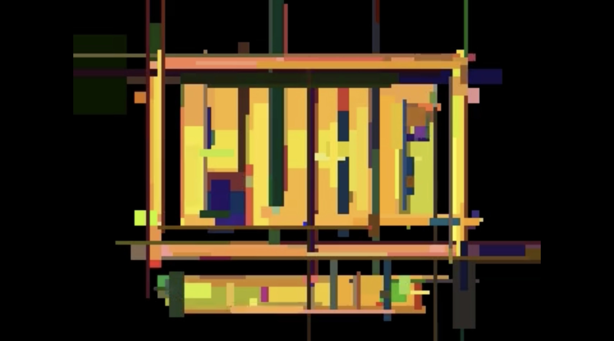
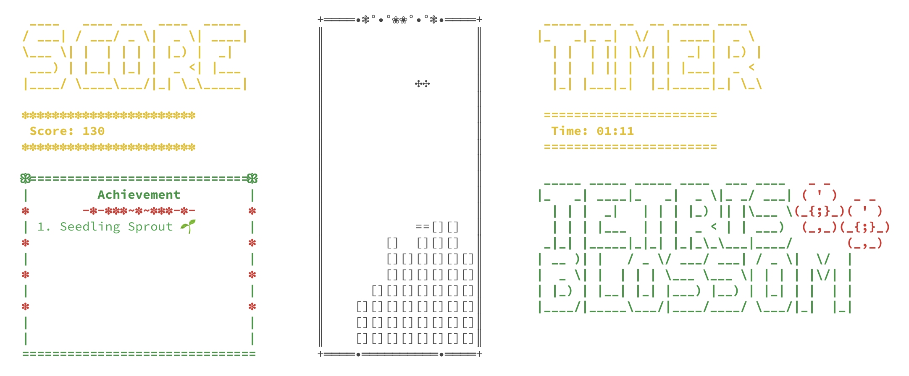
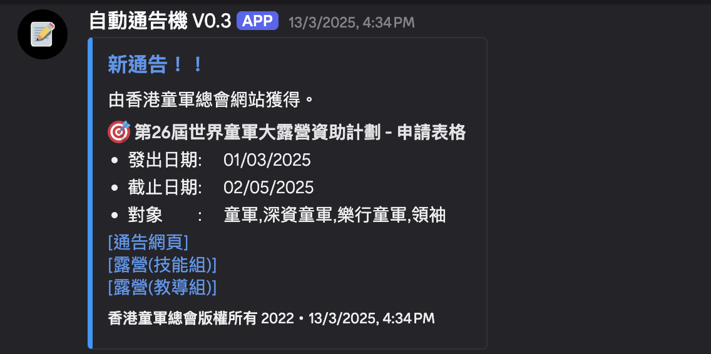
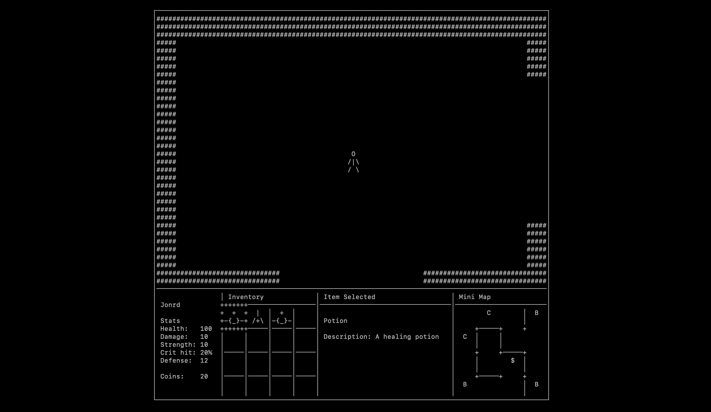
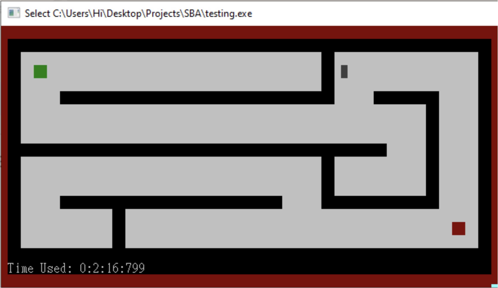

# 🌟 Yu Chung Yau (Jones) - Portfolio Website

<div align="center">


[](https://jonesyu30.github.io/Profolio-Website)
[](https://github.com/jonesyu30)
[](LICENSE)

**A modern, interactive portfolio website showcasing projects, hobbies, education, and contact information**

[View Live Demo](https://jonesyu30.github.io/Profolio-Website) • [Report Bug](https://github.com/jonesyu30/Profolio-Website/issues) • [Request Feature](https://github.com/jonesyu30/Profolio-Website/issues)

</div>

---

## 📖 About

This is a personal portfolio website for **Yu Chung Yau (Jones)**, a first-year Computer Science student at The University of Hong Kong. The website features a clean, modern design with smooth animations and an interactive 3D background, showcasing academic projects, personal hobbies, educational background, and contact information.

### ✨ Key Highlights

- 🎓 **Computer Science Student** at The University of Hong Kong (2024-2028)
- 💻 **Passionate Developer** with projects in Java, Python, JavaScript, and more
- 🎯 **Active Learner** with interests in archery, handball, scouts, and philosophy
- 🌐 **Open to Collaboration** and networking opportunities

---

## 🚀 Features

- ✅ **Responsive Design** - Fully responsive layout that works on all devices
- 🌓 **Dark/Light Mode** - Toggle between dark and light themes for comfortable viewing
- 🎨 **Interactive 3D Background** - Animated sphere particles for visual appeal
- 📱 **Mobile-Friendly Navigation** - Smooth scrolling and intuitive navigation
- 💼 **Project Showcase** - Detailed project cards with descriptions and images
- 📧 **Contact Form** - Functional contact form for easy communication
- 🔗 **Social Media Integration** - Links to GitHub, Instagram, and WhatsApp
- ⚡ **Fast Loading** - Optimized performance with minimal dependencies
- 🎯 **SEO Optimized** - Meta tags and structured data for better search visibility

---

## 🛠️ Technologies Used

<div align="center">


</div>

### Core Technologies

- **HTML5** - Semantic markup and structure
- **CSS3** - Modern styling with custom properties and animations
- **Vanilla JavaScript** - Interactive features without frameworks
- **Font Awesome** - Icon library for enhanced UI
- **Canvas API** - 3D particle animation background

---

## 📂 Project Structure

```
Profolio-Website/
├── assets/
│   └── images/              # Project screenshots and images
│       ├── profolio.jpeg
│       ├── java-image-postprocessing.png
│       ├── tetris-blossom.png
│       ├── dungeon-game.png
│       ├── pascal-maze.png
│       └── automatic-notice-scrapper.png
├── projects/                # Individual project detail pages
│   ├── java-image-postprocessing.html
│   ├── tetris-blossom.html
│   ├── dungeon-game.html
│   ├── pascal-maze.html
│   ├── discord-bot.html
│   ├── ngl-convo.html
│   ├── make-art-with-love.html
│   └── style.css
├── generator/               # Project page generator utility
│   ├── generator.js
│   ├── template.html
│   └── drafts/
├── index.html               # Main portfolio page
├── style.css                # Main stylesheet
├── style-dark.css           # Dark theme stylesheet
├── projects.js              # Project data and rendering logic
├── contact-me.js            # Contact form functionality
├── sphere.js                # 3D background animation
├── theme.js                 # Theme toggle functionality
└── README.md                # This file
```

---

## 🎯 Featured Projects

### 1. 🖼️ Java Image Postprocessing


An image filter generator using Evolution algorithms to recreate images with box-filters. Features a Java Swing GUI for visualizing the generation process with video export capabilities.

**Technologies:** Java, Swing, Evolution Algorithms

---

### 2. 🎮 Tetris Blossom ❀


A terminal-based Tetris clone developed in Python without external libraries. Group project achieving Grade A in ENGG1330 - Computer Programming.

**Technologies:** Python, Console Programming

---

### 3. 🤖 Automatic Notice Scrapper


A Discord bot that automatically scrapes and posts notices for scout groups, streamlining communication and organization.

**Technologies:** Node.js, Discord API, Web Scraping

---

### 4. 🏰 Dungeon Game


An interactive dungeon exploration game with procedural generation and turn-based combat mechanics.

**Technologies:** Python, Game Development

---

### 5. 🎨 Pascal Maze Generator


A maze generation and solving algorithm implemented in Pascal, demonstrating classic computer science algorithms.

**Technologies:** Pascal, Algorithms

---

## 🚦 Getting Started

### Prerequisites

- A modern web browser (Chrome, Firefox, Safari, Edge)
- Basic understanding of HTML/CSS/JavaScript (for development)
- Optional: A local web server for testing (e.g., Live Server extension for VS Code)

### Installation

1. **Clone the repository**
   ```bash
   git clone https://github.com/jonesyu30/Profolio-Website.git
   cd Profolio-Website
   ```

2. **Open the website**
   
   Simply open `index.html` in your web browser, or use a local development server:
   
   ```bash
   # Using Python's built-in server
   python -m http.server 8000
   
   # Or using Node.js http-server
   npx http-server
   ```

3. **Navigate to the website**
   
   Open your browser and go to:
   - `file:///path/to/Profolio-Website/index.html` (direct file)
   - `http://localhost:8000` (if using a local server)

### Deployment

This website is deployed on **GitHub Pages**. To deploy your own version:

1. Fork this repository
2. Go to repository Settings → Pages
3. Select the branch to deploy (usually `main` or `master`)
4. Save and wait for GitHub to deploy your site
5. Your site will be available at `https://yourusername.github.io/Profolio-Website`

---

## 💡 Usage

### Navigation

- **Home** - Hero section with introduction
- **Projects** - Browse through featured projects
- **Hobbies** - Personal interests and activities
- **Education** - Academic background
- **Contact** - Get in touch via contact form or social media

### Theme Toggle

Click the sun/moon icon in the bottom right corner to switch between light and dark modes. Your preference is saved in local storage.

### Project Pages

Click on any project card to view detailed information about the project, including:
- Project description
- Technologies used
- Key features and tasks
- Screenshots or demos
- Links to GitHub repositories (where applicable)

### Contact Form

Fill out the contact form with:
- Your name
- Email address
- Message

The form includes validation and will provide feedback on submission.

---

## 🎨 Customization

### Adding New Projects

1. Open `projects.js`
2. Add a new project object to the `PROJECT_JSON` array:
   ```javascript
   {
       "id": 8,
       "name": "Your Project Name",
       "language": "Technology",
       "tasks": [
           {
               "id": 1,
               "name": "Task Name",
               "description": "Task description"
           }
       ],
       "image": "./assets/images/your-image.png",
       "link": "your-project.html"
   }
   ```
3. Create a corresponding HTML page in the `projects/` directory

### Modifying Styles

- **Main styles**: Edit `style.css`
- **Dark theme**: Edit `style-dark.css`
- **Theme variables**: Use CSS custom properties defined in `:root`

### Changing Content

- **Personal information**: Edit `index.html`
- **Hobbies**: Update the hobbies section in `index.html`
- **Education**: Update the education section in `index.html`

---

## 🤝 Contributing

Contributions, issues, and feature requests are welcome! Feel free to check the [issues page](https://github.com/jonesyu30/Profolio-Website/issues).

### How to Contribute

1. Fork the Project
2. Create your Feature Branch (`git checkout -b feature/AmazingFeature`)
3. Commit your Changes (`git commit -m 'Add some AmazingFeature'`)
4. Push to the Branch (`git push origin feature/AmazingFeature`)
5. Open a Pull Request

---

## 📧 Contact

**Yu Chung Yau (Jones)**

- 🌐 Website: [https://jonesyu30.github.io/Profolio-Website](https://jonesyu30.github.io/Profolio-Website)
- 💼 GitHub: [@jonesyu30](https://github.com/jonesyu30)
- 📷 Instagram: [@jung1yau6](https://www.instagram.com/jung1yau6/)
- 💬 WhatsApp: [+60303742](https://wa.me/60303742)

---

## 📜 License

This project is open source and available under the [MIT License](LICENSE).

---

## 🙏 Acknowledgments

- Font Awesome for the icon library
- The University of Hong Kong for educational support
- All contributors and supporters of this project

---

<div align="center">

### ⭐ Star this repository if you found it helpful!

Made with ❤️ by [Jones](https://github.com/jonesyu30)

</div>
